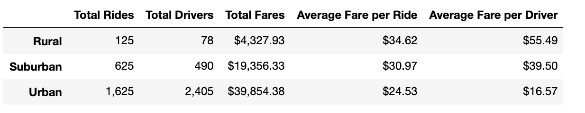

# Challenge Solution Grading Instructions

The objective of this challenge is for learners to create a summary DataFrame of the key metrics for the ride-sharing data by city type, and then they'll use two new Pandas functions, `pivot()` and `resample()` with Matplotlib to create a multiple-line graph that shows the total fares for each week by city type. Finally, the learners will write a report on the results of the new analysis.

## Deliverable 1: A Summary Ride-sharing DataFrame by City Type

For the first deliverable, we are asking the learners to use the Pandas `groupby()` function with the `count()` and `sum()` methods on DataFrame columns to get the total number of rides, drivers and fares for each city type. Then using some data munging they'll need to calculate the average fare per ride and average fare per driver for each city type. Finally, they'll add this data to a new DataFrame and format the columns.

We have provided the learners with a [PyBer Challenge starter code](../Resources/PyBer_Challenge_starter_code.ipynb) that has comments as to where the learners will need to add code to complete this part of the challenge.

We are instructing the learners to download the `PyBer_Challenge_starter_code.ipynb` file into your PyBer_Analysis folder and rename it `PyBer_Challenge.ipynb` before they start on the challenge.

The summary DataFrame should have the total rides, total drivers, the total fares, the average fare per ride and the average fare per driver for each city type.

## Deliverable 2: A Multiple-line Chart of Total Fares for each City Type

For the second deliverable, the learners will need to create a multiple-line graph using the Matplotlib "fivethirtyeight" graph style that shows the total fares for each week by city type.

This part of the challenge may be more challenging than Deliverable 1. We have provided the learners with a [starter code](../Resources/PyBer_Challenge_starter_code.ipynb) that has comments as to where the learners will need to add code to complete this part of the challenge. Here is a breakdown of what they need to do:

1. First, they'll need to use the `groupby()` function to create a multi-index DataFrame on the city "type" and "date" columns, and apply the `sum()` method on the "fare" column to get the total fare amount.
2. Next, they'll use the `reset_index()` method to place all the data in columns.
3. Then they'll use the `pivot()` function to reshape the data where the index is the `date`, the columns are the `'type'` of city, and values are `fare`.
4. Next, they'll need to use the `loc` method on a date range to filter the data.
5. Convert the date, which will be the index, to a `datetime` datatype, but checking the datatype before and after using `df.info()`.
6. Then they'll use the `resample()` function to reshape the data in weekly bins, i.e., `('W')`, and then apply the `sum()` method to get the total fares for each week.
7. Finally, they'll use the object-oriented interface method plot the resampled DataFrame using the Matplotlib style, `"fivethirtyeight"`.

We have provided code snippets for `reset_index()`, `df.info()`, and converting the index to a `datetime` datatype to help the learners with these steps.

We have also provided two videos. The first video we show them how to use the `pivot()` function. We also show them how to create a multi-index DataFrame using the `groupby()` function, and resetting the index just like they'll do in this challenge. In the second video we show them how to use the `resample()` function. We also show them how to rest the index and use the `info()` function, just like they'll do in this challenge.

The multi-line graph should have a line for each city type, that shows the sum of the fares for each week on one graph.

## Deliverable 3: Written Report for the PyBer Analysis

Again, the goal of the writing assignment is for learners to present their findings in a logical manner. As a reminder, learners should use appropriate grammar and structure when writing.

For the written analysis, learners should use the repository README.md to write their report. The report will contain three sections: an overview of the analysis, results, and summary.

**Overview of the analysis:** Explain the purpose of this analysis.

**Results:** Using images from the summary DataFrame and multiple-line chart, describe the differences in ride-sharing data among the different city types.

**Summary:** Based on the results, provide three business recommendations to the CEO for addressing any disparities among the city types.

The README.md document should be in the home directory of their repository. All links should be working, and images and code should be formatted and displayed where appropriate.

## Solution File

The final solution, [PyBer challenge solution](PyBer_Challenge_Solution.ipynb), is provided for you to as a reference when checking learners' submissions.

The challenge submission should contain the `PyBer_Challenge.ipynb` file, the the "Resources" folder with the `city_data.csv` and `ride_data.csv` files, and an update repository README.md that has the written analysis.

## Grading Rubric

The [PyBer Grading Rubric](../Resources/PyBer_Grading_Rubric.pdf) is provided for you to use when grading the learners' submissions.
