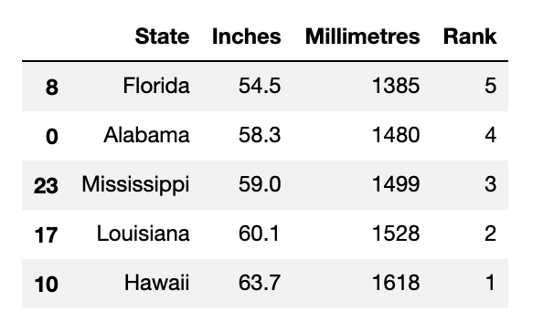
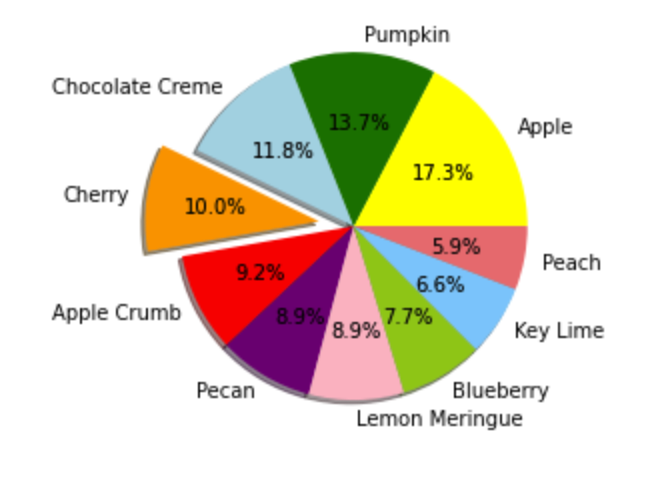
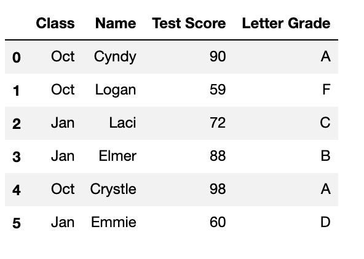

```python
# Dependencies
import pandas as pd
import numpy as np
```

# 1.


```python
import os
import csv

cereal_csv = os.path.join("Resources", "cereal.csv")

# Open and read csv
with open(cereal_csv, newline="") as csvfile:
    csvreader = csv.reader(csvfile, delimiter=",")

    # Read the header row first (skip this part if there is no header)
    csv_header = next(csvfile)
    # print(f"Header: {csv_header}")

    # Read through each row of data after the header
    for row in csvreader:

        # Convert row to float and compare to grams of fiber
        if float(row[7]) >= 5:
            print(row[0])
```

    100% Bran
    All-Bran
    All-Bran with Extra Fiber
    Bran Flakes
    Fruit & Fibre Dates; Walnuts; and Oats
    Fruitful Bran
    Post Nat. Raisin Bran
    Raisin Bran


# 2.


```python
name = "Dan"
classroom_1 = ["Greg", "Tony", "Susan"]
classroom_2 = ["Gerald", "Paul", "Ryder"]
classroom_3 = ["Carla", "Dan", "Jefferson"]

if name in classroom_1:
    print(f"{name} is in the classroom 1.")
elif name in classroom_2:
    print(f"{name} is in the classroom 2.")
else:
    print(f"{name} in the classroom 3.")

```

    Dan in the classroom 3.


# 3.


```python
# Retrieve data from specific columns of a DataFrame.
df = pd.read_csv("Resources/donors2008.csv")
df_state_avgs = df.groupby(["State"]).mean()["Amount"]
df_state_avgs.loc[df_state_avgs >=750.00].count()
```


    9


# 4


```python
import os
import csv

file_to_save = os.path.join("output", "employees.txt")

with open(file_to_save, "w") as new_file:
    employees = (
        f"First Name', 'Last Name', 'SSN\n"
        f"Caleb', 'Frost', '505-80-2901\n")
    
    # bad line of code 
    txt_file.write(employees) 

```


    ---------------------------------------------------------------------------

    NameError                                 Traceback (most recent call last)

    <ipython-input-5-694000fbee37> in <module>
         10 
         11     # bad line of code
    ---> 12     txt_file.write(employees)
    

    NameError: name 'txt_file' is not defined


# 5. 


```python
import os
import csv

file_to_save = os.path.join("output", "employees.txt")

with open(file_to_save, "w") as new_file:
    employees = (
        f"First Name', 'Last Name', 'SSN\n"
        f"Caleb', 'Frost', '505-80-2901\n")
    
    # correct line of code 
    new_file.write(employees)
```

# 6.


```python
# A dictionary can contain multiple pairs of information
actress = {
    "name": "Angelina Jolie",
    "genre": "Action",
    "nationality": "United States"
}

actress.keys()
```


    dict_keys(['name', 'genre', 'nationality'])


```python

# What Python method is used to get all the keys from a dictionary?


# (MC)

# get() 
# keys() ✅
# get_keys() 
# key() 

```

# 7.


```python
students = ("Frank", "Mary", "Jasmine", "Ivana", "Ahmed")
students.append("Serena")
print(students)
```


    ---------------------------------------------------------------------------

    AttributeError                            Traceback (most recent call last)

    <ipython-input-9-72be960c98fd> in <module>
          1 students = ("Frank", "Mary", "Jasmine", "Ivana", "Ahmed")
    ----> 2 students.append("Serena")
          3 print(students)


    AttributeError: 'tuple' object has no attribute 'append'


# 8.


```python
# df.to_csv("o=Uutput/data_file.csv", index=False)
#  or
# df.to_csv("Output/data_file.csv", index=False, header=True)
```

# 9.


```python
# Load in csv
rain_df = pd.read_csv("Resources/avg_rain_state.csv")

#  Sort the DataFrame on the colum "Rank" in ascending order.
#  What are the top 5 states based on rank in the DataFrame?
rain_df.sort_values(['Rank'], ascending=False).tail()
```

    

    


# 10.


```python
%matplotlib inline

# Dependencies
import matplotlib.pyplot as plt

x_axis = np.arange(len(rain_df))
tick_locations = [value for value in x_axis]
plt.figure(figsize=(20,3))
plt.bar(x_axis, rain_df["Inches"])
plt.xticks(tick_locations, rain_df["State"], rotation="vertical")
plt.title("Rain in Inches by State")
plt.xlabel("State")
plt.ylabel("Rain (inches)")

plt.show()
```


    

    


# 11.


```python
# What is the mean rainfall for the entire DataFrame?
rain_df.Inches.mean()
```


    37.078


```python
# What is the median rainfall for the entire DataFrame?
rain_df.Inches.median()
```


    41.75


```python
# How many modes are there for rainfall?
rain_df.Inches.mode()
```


    0    28.9
    1    42.2
    2    50.3
    dtype: float64


# 12.


```python
pies = ["Apple", "Pumpkin", "Chocolate Creme", "Cherry", "Apple Crumb", "Pecan", "Lemon Meringue", "Blueberry", "Key Lime", "Peach"]
pie_votes = [47,37,32,27,25,24,24,21,18,16]
colors = ["yellow","green","lightblue","orange","red","purple","pink","yellowgreen","lightskyblue","lightcoral"]
explode = (0,0,0,0.2,0,0,0,0,0,0)
```


```python
# Tell matplotlib to create a pie chart based upon the above data
plt.pie(pie_votes, explode=explode, labels=pies, colors=colors,
        autopct="%1.1f%%", shadow=True)

# Create axes which are equal so we have a perfect circle

plt.show()
```


    

    


# 13.


```python
test_grades = {
    'Class': ['Oct', 'Oct', 'Jan', 'Jan', 'Oct', 'Jan'], 
    'Name': ["Cyndy", "Logan", "Laci", "Elmer", "Crystle", "Emmie"], 
    'Test Score': [90, 59, 72, 88, 98, 60]}

df = pd.DataFrame(test_grades)
df

# Create the bins in which Data will be held
# Bins are 0, 59, 69, 79, 89, 100.   
bins = [0, 59, 69, 79, 89, 100]

# Create the names for the four bins
letter_grades = ["F", "D", "C", "B", "A"]

df["Letter Grade"] = pd.cut(df["Test Score"], bins, labels=letter_grades)
df
```




# 14.


```python
import requests
import json
url = "https://api.spacexdata.com/v2/launchpads"

response = requests.get(url).json()

len(response)
```


    6


# 15.


```python
for i in range(len(response)):
    print(response[i]["full_name"])
```

    Vandenberg Air Force Base Space Launch Complex 3W
    Cape Canaveral Air Force Station Space Launch Complex 40
    SpaceX South Texas Launch Site
    Kwajalein Atoll Omelek Island
    Vandenberg Air Force Base Space Launch Complex 4E
    Kennedy Space Center Historic Launch Complex 39A


# 16.


```python
# The name variable is "Dan" from #2 above. Run this code first. 
del name
try:
    print("Infinity looks like + " + str(10 / 0) + ".")
except ZeroDivisionError:

    try:
        
        print("I think her name was " + name + "?") 
    except NameError:
  
        try:
            print("Your name is a nonsense number. Look: " + int("Gabriel"))
        except ValueError:
            print("I made it through the gauntlet. The message survived!")
```

    I made it through the gauntlet. The message survived!


# 17.


```python
import json
import os

filepath = os.path.join("youtube_response.json")
with open(filepath) as jsonfile:
    video_json = json.load(jsonfile)

#  What is the code to retrieve the link to the video's default thumbnail?
video_json['data']['items'][0]['thumbnail']['default']
```


    'http://i.ytimg.com/vi/hYB0mn5zh2c/default.jpg'


# 18.


```python
# You have converted a CSV file to a DataFrame,“df”. How would you get the names of the columns from the DataFrame?
df.columns
```


    Index(['Class', 'Name', 'Test Score', 'Letter Grade'], dtype='object')


# 19.


```python
# What is the matplotlib function that is used to create box and whisker plots?


# (MC)

# function()
# def ✅
# define(): 
# def():
```

# 20.


```python

# What is the matplotlib function that is used to create box and whisker plots?


# (MC)

# boxwhisker() 
# boxplot() ✅
# box() 
# boxplots() 

```


```python

```
