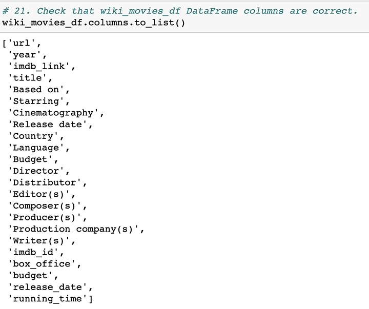
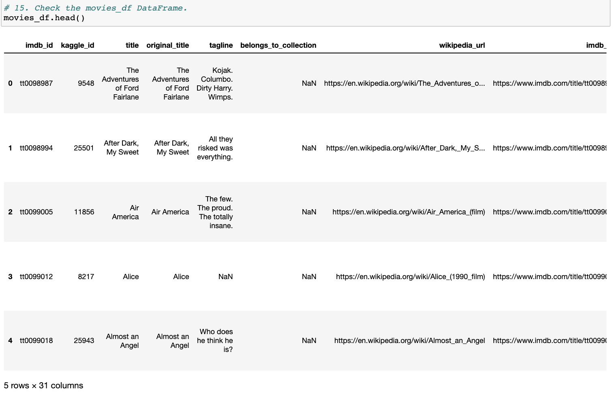
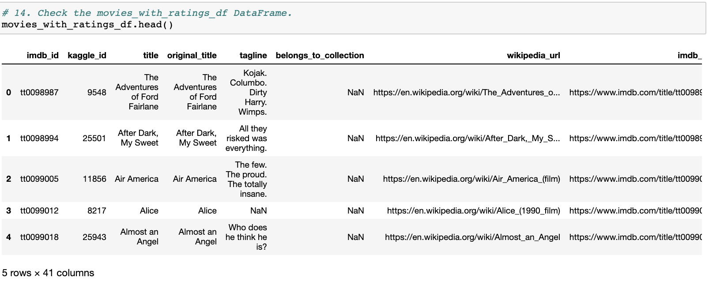

# Challenge Solution Grading Instructions

The objective of this challenge is for learners to create an automated ETL pipeline using a function that takes in the three data files and performs the extraction, cleans and transforms the data using Pandas and regular expressions, and then loads the new data into PostgreSQL database.

## Deliverable 1: Write an ETL function to read three data files

For the first deliverable, we are asking the learners to write a function that reads in three files as arguments and converts the files to Pandas DataFrames. This deliverable shouldn't be too challenging. But it is important to get the data passed into the function to convert the JSON data and CSV files to DataFrames. 

* We have provided [starter code](../Resources/ETL_Deliverable1_starter_code.ipynb) that they should download and add to their Movies-ETL GitHub folder, and rename the file `ETL_function_test.ipynb`. The starter code, has commented steps in the file where learners will need to add the modified code from the module solution to complete this part of the challenge.

    * The code in Steps 6-11 is to help them read in the files and display the DataFrames. In Step 7, we have made the three variables equal to the function name.  

    ``` python
    # 7. Set the three variables in Step 6 equal to the function created in Step 1.
    wiki_file, kaggle_file, ratings_file = function_name()
    ```

    * This allows them to change the variables by assignment. This is done in Step 8, where we assign the DataFrames equal to these variables in order to display the DataFrames.

    ``` python
    # 8. Set the DataFrames from the return statement equal to the file names in Step 6.
    wiki_movies_df = wiki_file
    kaggle_metadata = kaggle_file
    ratings = ratings_file

    ```

### Solution 

We have provided [ETL_Deliverable1_ETL_function](../Challenge_Solution/ETL_Deliverable1_ETL_function.ipynb) as a reference when checking learners' submission. 

## Deliverable 2:  Extract and Transform the Wikipedia Data 

For the second deliverable, the learners will need to extract, clean, and transform the Wikipedia data so it can be merged with the Kaggle metadata in Deliverable 3. 

* This deliverable will be a bit challenging, there is a lot of code to add and modify so that the function works without errors. Be mindful of formatting. Encourage them to keep or edit the commented sections for an easier workflow. 

* For this deliverable we have provided [starter code](../Resources/ETL_Deliverable2_starter_code.ipynb) that they should download and add to their Movies-ETL GitHub folder, and rename the file `ETL_clean_wiki_movies.ipynb`. 

* In the `ETL_clean_wiki_movies.ipynb` file they can add the clean movie function from the module that takes in the argument, "movie" before the function they wrote in Deliverable 1, and then add the function that reads in the three data files in the next cell.

* There is one new task in this deliverable. In Step 6, they will need to write a `try-except` block that will catch errors while extracting the IMDb ID using a regular expression string and dropping any `imdb_id` duplicates. If there is an error, capture and print the exception. This will require them to refactor the code form the module. 
 
The `wiki_movies_df` DataFrame should look like this: 


The columns of `wiki_movies_df` DataFrame should look like this:



### Solution 

We have provided [ETL_Deliverable2_clean_wiki_movies](../Challenge_Solution/ETL_Deliverable2_clean_wiki_movies.ipynb) as a reference when checking learners' submission. 

## Deliverable 3: Extract and Transform the Kaggle Data

For the third deliverable, the learners will need to extract, clean, and transform the Kaggle metadata and MovieLens rating data and then convert the transformed data into separate DataFrames. Then, they’ll merge the Kaggle metadata DataFrame with the Wikipedia movies DataFrame to create the `movies_df`. Finally, they’ll merge the MovieLens rating data DataFrame with the `movies_df` DataFrame to create the `movies_with_ratings_df`.

* This deliverable will challenging. Again, there is a lot of code to add and modify so that the function works without errors, which can lead to errors. Be mindful of formatting. Encourage them to keep or edit the commented sections for an easier workflow. 

* For this deliverable we have provided [starter code](../Resources/ETL_Deliverable3_starter_code.ipynb) that they should download and add to their Movies-ETL GitHub folder, and rename the file `ETL_clean_kaggle_data.ipynb`. 

* In the `ETL_clean_kaggle_data.ipynb` file they can add the clean movie function in the second cell, and then add the function they wrote in Deliverable 1 that reads in the three data files in the third cell. They'll need to add all the code they wrote for Deliverable 2 above the following step, ` # 2. Clean the Kaggle metadata`. 

The `movies_df` DataFrame should look like this: 



The `movies_with_ratings_df` DataFrame should look like this:



### Solution 

We have provided [ETL_Deliverable3_clean_kaggle_data](../Challenge_Solution/ETL_Deliverable3_clean_kaggle_data.ipynb) as a reference when checking learners' submission. 

## Deliverable 4: Create the Movie Database

For the final deliverable, the learners will need to load the new data into PostgreSQL database.

* First, they'll need to copy the `ETL_clean_kaggle_data.ipynb` file in the Movies-ETL GitHub and rename the file `ETL_create_database.ipynb`. 

* When they add the code to create the connection to the postgreSQL database that converts the `movies_df` DataFrame to a SQL database they'll neeed to use `'replace'` for the `if_exists` parameter so that the `movies_df` DataFrame isn't appended to the `movies` table. 

* Before they add the MovieLens rating CSV data to the database, they'll need to drop the table in postgreSQL. This should be familiar to them as they have covered dropping tables in previous module. 

### Solution

We have provided [ETL_Deliverable4_create_database](../Challenge_Solution/ETL_Deliverable4_create_database.ipynb) as a reference when checking learners' submission. 


## Submission

Make sure they upload the following to their Movies-ETL GitHub repository:

1. The `ETL_function_test.ipynb` file. 
2. The `ETL_clean_wiki_movies.ipynb` file.
3. The `ETL_clean_kaggle_data.ipynb` file.
4. The `ETL_create_database.ipynb` file.
5. A Resources folder with the `wikipedia.movies.json`, `movies_metadata.csv`, `ratings.csv`, `movies_query.png`, and `ratings_query.png` files.
6. A README.md that describes the purpose of the repository.  Although there is no graded written analysis for this challenge, it is encouraged and good practice to add a brief description of your project.

## Grading Rubric

The [ETL-Movies Grading Rubric](../Resources/ETL-Movies_Grading_Rubric.pdf) is provided for you to use when grading the learners' submissions.
