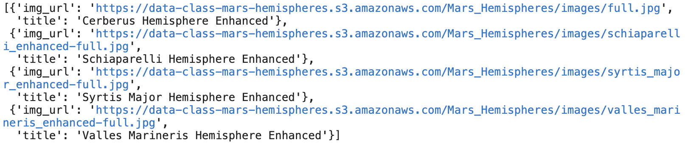
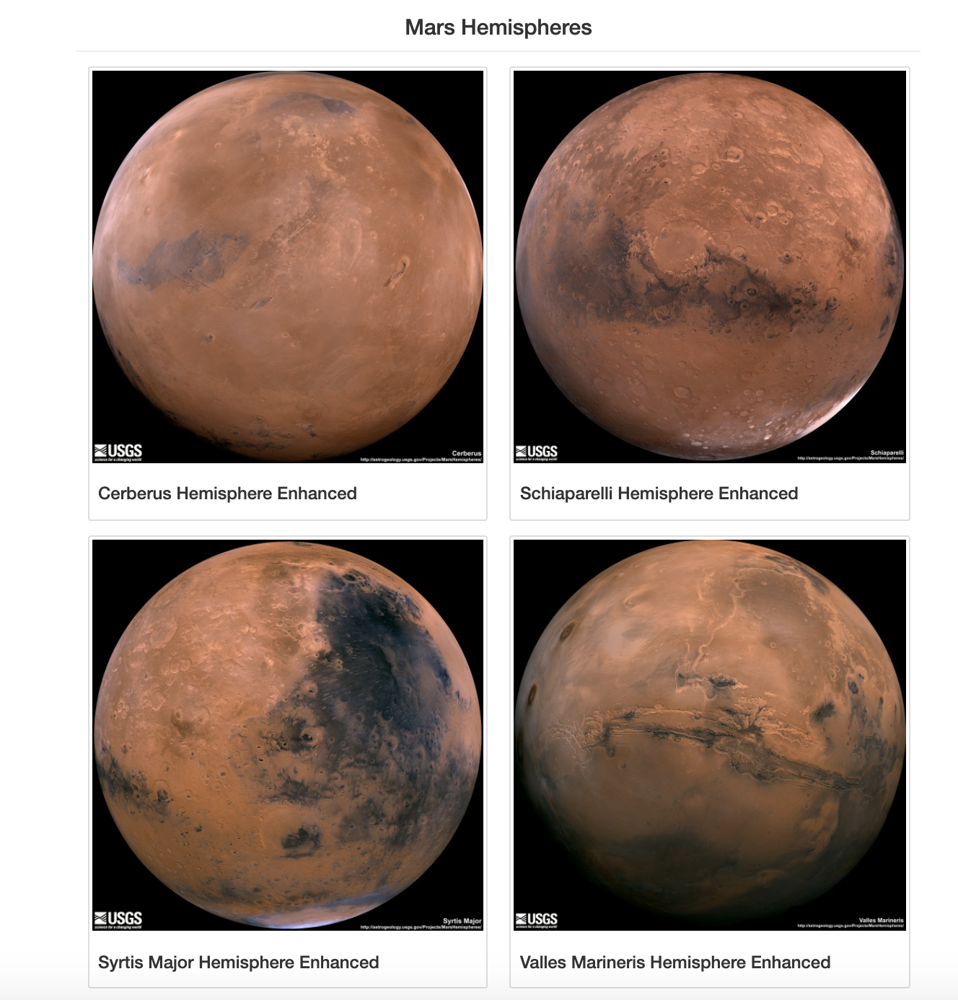

# Challenge Solution Grading Instructions

The objective of this challenge is for learners to scrape high-resolution images of Mars’ hemispheres and titles, update the Mongo database, and modify the `index.html` file so the webpage contains all the information collected in this module as well as the full-resolution images and titles of the four hemispheres.

## Deliverable 1: Scrape Full-Resolution Mars Hemisphere mages and Titles

For the first deliverable, we are asking the learners to scrape high-resolution images of Mars’ hemispheres and their titles.

The learners might find the tasks in this challenge to be slightly difficult. There is no one specific method to retrieve the high-resolution image and title of each hemisphere. However, we have provided [starter code](../Resources/Mission_to_Mars_Challenge_starter_code.ipynb) that they should download, copy, and add to their `Mission_to_Mars_Challenge.ipynb` file.

The starter code, has commented steps in the file where learners will need to add code to complete this part of the challenge. For Step 3, we have provided a hint of a common approach to retrieve the full-resolution images and titles of each hemisphere.

  * Before the `for` loop, we suggest that the learners find the HTML tag that holds all the links to the full-resolution images, or find a common CSS element for the full-resolution image.

  * Then, in the `for` loop that should iterate throught the tags or CSS element.

  * Before clicking on each hemisphere link, they should create an empty dictionary. We suggest in the **Hint** to use, `hemispheres = {}`.

  * Next, they should use the `for` loop to click on each hemisphere link and navigate to the full-resolution image page, retrieve the full-resolution image URL string and the title for each hemisphere. **Hint** this step will be similar to scraping the Featured Image and they will need to use the base URL to create the full URL.

  * Inside the `for` loop they should save the full-resolution image URL string as the value for the key, `img_url`, and the title as the value for the key, `title`, in the `hemispheres = {}` dictionary.

  * Before getting the next image URL and title, they'll need to add the `hemispheres = {}` dictionary to the `hemisphere_image_urls` list.

When they print out the list of dictionary items, they should be similar to this image:

## Deliverable 2: Update the Web App with Mars’s Hemisphere mages and Titles

For the second deliverable, the learners will need to add the code they created in Deliverable 1 to their `scraping.py` file, update their Mongo database, and modify their `index.html` file so the webpage contains all the information they collected in this module as well as the full-resolution image and title of each hemisphere.

The learners might find the tasks in this challenge to be more challenging than Deliverable 1. Where they may find the most difficulty, is after they export the `Mission_to_Mars_Challenge.ipynb` file as a Python file and create a new function that scrapes the hemisphere data.

There is not a specific method to writing this function. You may use the `scraping.py` [solution](scraping.py) to guide them if they need help.

We have provided an updated `index.html` [file](../Resources/index.html) for them to use that will add the hemispehre data to the webpage. However, they may need to modify the HTML code if they have a different database or dictionary name when they loop through the dictionary in the database using, ``. Finally, they will need to run the `app.py` file, open the `index.html`, and click the "Scrape New Data" button.

The full-resolution images should be rendered on the webpage as shown in the following image.

## Deliverable 3: Add Bootstrap 3 Components

For the final delivareable, we are asking the learners to update their web app to be mobile responsive and add two additional Bootstrap 3 components to make their website standout.

They learners should not find the tasks in this deliverable to be difficult. Using the DevTools they will need to make sure that their web app is mobile responsive for all the data on the webpage. If not, they will need to use the [Bootstrap 3 grid system](https://getbootstrap.com/docs/3.3/examples/grid/) to make the web app mobile responsive.

They will also need to apply two additional Bootstrap 3 components to make their webpage standout. We have provided three examples for them, or they can choose other options from this [list](https://getbootstrap.com/docs/3.3/css/).

## Solution File

The final solution, [Mission to Mars Challenge solution](Mission_to_Mars_Challenge_solution.ipynb), is provided for you to as a reference when checking learners' submissions.

## Submission

Make sure they upload the following to their surfs_up GitHub repository:

1. The `Mission_to_Mars_Challenge.ipynb` file with all the code used for scraping.
2. An updated `scraping.py` file.
3. The `app.py` file.
4. The `index.html` file in the template folder and any CSS stylesheets.

## Grading Rubric

The [Misson to Mars Grading Rubric](../Resources/Mission-to-Mars_Grading_Rubric.pdf) is provided for you to use when grading the learners' submissions.
