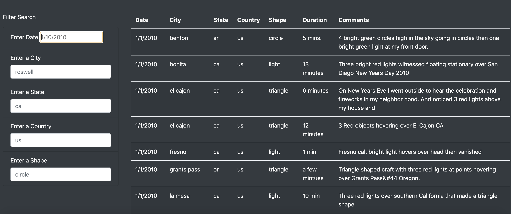

# Challenge Solution Grading Instructions

The objective of this challenge is for learners to create multiple search criteria in addition to the date filter you created in this module. When a user enters the search criteria the `app.js` will store the element, value, and the id of the filter that was changed and then filter the dataset and keep only the data that matches search criteria. The search criteria will will be rendered on the webapge. 

## Deliverable 1: Filter UFO Sightings on Multiple Criteria

For the first deliverable, we are asking the learners to modify their `index.html` by removing the list element that creates the button to click, and adding four new list elements for city, state, country, and shape.  Then they'll need to capture all the elements, values and ids that are changed when the search criteria are entered and then filter the dataset and render the filtered data on the webpage.  

The learners might find the tasks in this challenge to be slightly difficult. We have provided [starter code](../Resources/ufo_starteCode.js) that they should download, rename as `app.js`, and place it in the js folder of  your UFOs GitHub repository.  

**Important:** Make sure they change the name of their `app.js` file used for the module solution before they rename the `ufo_starteCode.js` file.

First, they'll need to modify their `index.html` file to remove the list element that creates the button and create four new list elements for the additonal search criteria. The search criteria should be similar to this image:

Next, they'll need to use the starter code to complete the challenge. 

  * After they create the variable that will keep track of all the filters as a JavaScript object. They'll need to modify the event listener on line 62 that detects changes on each input element and calls the `updateFilters()` function.

  * In Steps 3-5, they'll need to write code in the `updateFilters();` function to hold all the values and ids of the filters that were changed on user input in the variable they created in Step 1. If learners have a difficult time with this part, we have provided a video for them.

  * In Steps 7-10, they'll need to write code in the `filterTable();` function to filter the dataset based on the search critieria that is stored in the filters object.  In this function, they'll need to use the `forEach(([key, value])` as they are looping through the filters and then use the `filter` method to filter the table data based on the value for the row's property.

  * Finally, they'll need to rebuild the table based on the filtered data. 

## Deliverable 2: A written report on the UFO analysis (README.md) 

Again, the goal of the writing assignment is for learners to present their findings in a logical manner. As a reminder, learners should use appropriate grammar and structure when writing.

For the written analysis, learners should use the repository README.md to write their report. The report will contain three sections: an overview of the analysis, results, and summary.

**Overview of Project:** Explain the purpose of this analysis.

**Results:** Describe to Dana how someone might use the new webpage by walking her through the process of using the search criteria. Use images of your webpage during the filtering process to support your explanation.

**Summary:** In a summary statement, describe one drawback of this new design and two recommendations for further development.

The README.md document should be in the home directory of their repository. All links to images should be formatted and displayed where appropriate.

## Solution File

The final solution, [UFO Challenge solution](app.js), is provided for you to as a reference when checking learners' submissions.

## Submission

Make sure they upload the following to their surfs_up GitHub repository:

1. The updated `app.js` file with the code for the challenge.
2. The updated `index.html` file in the template folder.
3. The `data.js` file.
4. An updated README.md that has your written analysis.

## Grading Rubric

The [UFOs Grading Rubric](../Resources/UFOs_Grading_Rubric.pdf) is provided for you to use when grading the learners' submissions.
